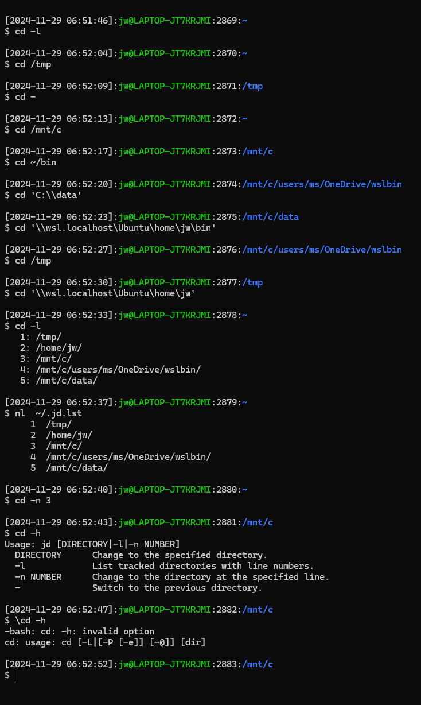

# jd.bash: Bash cd command enhancement 

This short clog introduces the jd Bash shell function that enhances the cd command under WSL to make it easier to access past working directories without the need to remember or type their paths, as well as to allow typing and pasting Windows paths.

- https://github.com/deliverystack/wslbin/blob/main/bin/jd.bash

You can use the jd function just as you would the cd command. You can alias cd to the jd function so that you get this behavior without having to retrain your fingers to type jd instead of cd. This function uses $HOME/.jd.lst to store directory paths.

If you pass a Windows path such as `C:` or `\\wsl.localhost\Ubuntu\` the function will use the wslpath command to convert them to the corresponding Unix paths.

You can pass `-l` to get a list of past working directories.

You can pass `-n` to specify one of those entries by number.

If you alias cd to jd, you can use any of these approaches to ignore the alias and invoke the Bash native cd command:

- `\cd`
- `builtin cd`
- `command cd /path/to/directory`

I add this function and alias to a file that the shell sources at startup.

- https://wslguy.net/2021/02/13/wsl-configure-bash-shell-initialization/

Credit to Clippy 2.0:

- https://chatgpt.com/c/6748f4a3-1ef0-8005-8c92-e7308e89a2ed

Original blog:

- https://wslguy.net/2024/11/28/wsl-bash-cd-enhancement-to-track-directories-across-sessions/